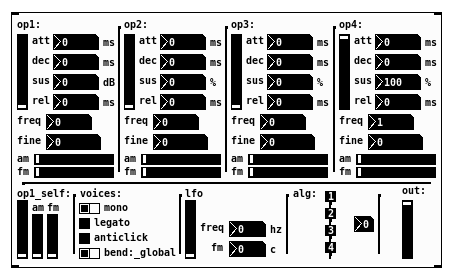

# dm7617~
Sintetizador FM inspirado en el chip YM2612, desarrollado en [Pure Data](https://github.com/pure-data/pure-data).  
  
</img>

## instalación
Descargar el zip y extraer la carpeta (o clonar el repositorio) dentro de una ruta de búsqueda de pure data. Ya se puede iniciar desde cualquier parche creando el objeto `[pd-dm7617/dm7617~]`.  
  
Depende del objeto [`[adsr~]`](https://github.com/teaecetyrannis/pd-adsr), por lo que también deberá instalarse.

## documentación
En la help-file de dm7617~.pd se encuentra toda la información sobre su funcionamiento.
	

## créditos
- [Pure Data](https://github.com/pure-data/pure-data) por Miller Puckette y muchxs más.
